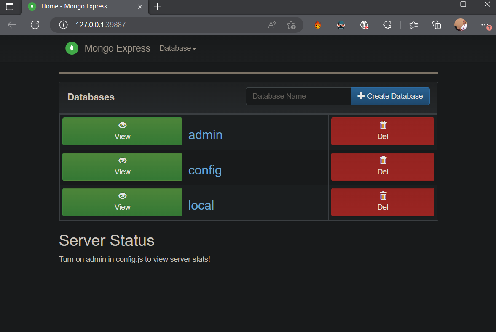
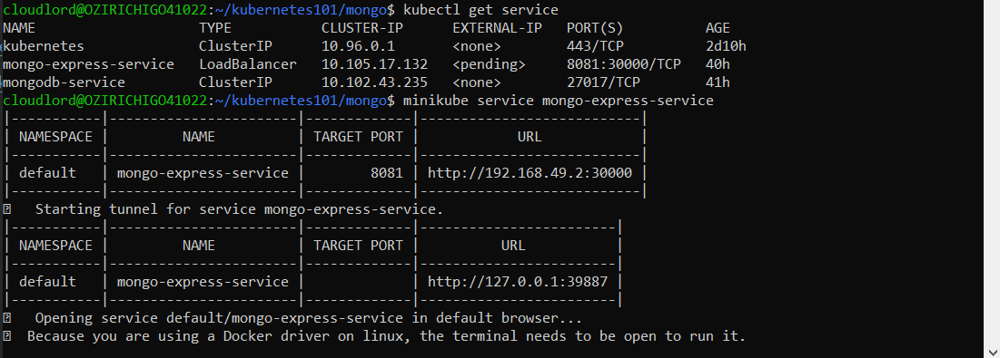

# 1. history | grep minikube > minikube-cmd.md
2.  curl -LO https://storage.googleapis.com/minikube/releases/latest/minikube-linux-amd6
3.  sudo install minikube-linux-amd64 /usr/local/bin/minikube
4.  minikube config set driver virtualbox
5.  minikube start
6.  minikube start --vm-driver=docker
NB: `--vm-driver` is deprecated. Use `--driver` instead.
7.  minikube start --driver=docker
8.  minikube get nodes
9.  minikube start --driver=hyperv
10. minikube status
11. minikube service mongo-express-service

Get the service name from the default namespace by running `kubectl get service`. 

12. minikube dashboard

